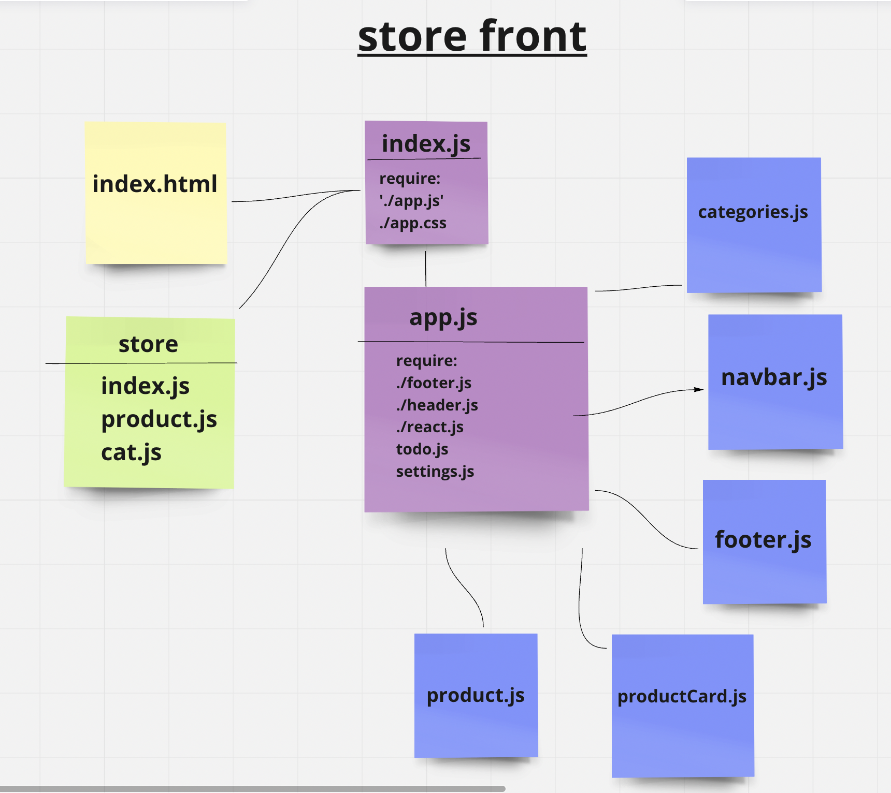

# storefront

- phase 1:

our goal is to setup the basic scaffolding of the application with initial styling and basic behaviors. This initial build sets up the file structure and state management so that we can progressively build this application in a scalable manner

As a user, I expect to see a list of available product categories in the store so that I can easily browse products
As a user, I want to choose a category and see a list of all available products matching that category
As a user, I want a clean, easy to use user interface so that I can shop the online store with confidence

- Phase 2:

 Continue work on the e-Commerce storefront, breaking up the store into multiple reducers and sharing functionality/data between components.

## [Netlify Link]( https://saraaltayeh.github.io/storefront/)

## UML

